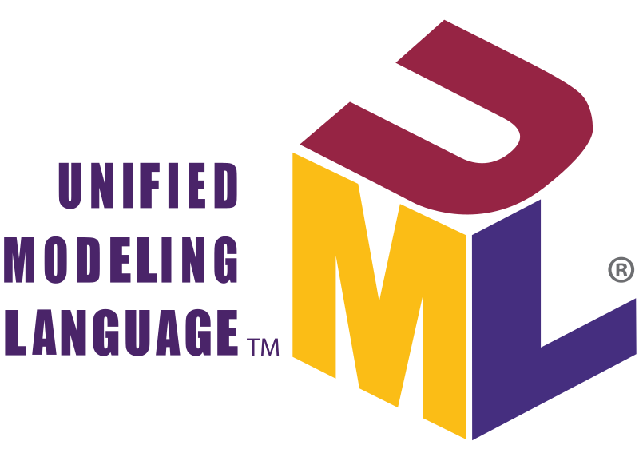

# Advanced OOP Pescine - Module 02 (UML)



## About

the third module of the advanced OOP pescine, this module will introduce Universal Modeling Langage. 
Here is the link to the [subject](https://cdn.intra.42.fr/pdf/pdf/109505/en.subject.pdf)

## Installation && Usage

1. Clone the repository to your local machine:

   ```bash
   git clone git@github.com:Stilram19/pescine-object-module02-UML.git
   ```

2. Navigate to the repository's directory and find the UML class diagram in 'subject.png':

    ```bash
    cd pescine-object-module02-UML/ex00
    ```

## Notes:

- **Singleton Pattern**:
  - The Singleton design pattern ensures that only one instance of a class can be instantiated throughout the entire application.
  - In C++, this is implemented by making all constructors private, ensuring the class cannot be instantiated outside its declaration or definition.
  - Then, declare a function with a static variable (`static Class object;`) that always returns the same static object.
  - Refer to the `learn.cpp` file for a straightforward example.

- **Multiplicity in UML**:
  - Multiplicity represents how many instances of one class can be connected to an instance of another class.
    - **Aggregation and Composition**:
      - The multiplicity string next to the diamond specifies how many instances of the containing class can have the same instance of the contained class.
      - The string next to the contained class indicates how many instances of the contained class are held by one instance of the containing class.
      - For aggregation, we use "collecting" and "collected" instead of "containing" and "contained."
    - **Aggregation Between an Interface and Another Class**:
      - If the UML tool you are using doesn't support this type of relationship, you can use an association arrow (`0---0..1`) to represent aggregation, since aggregation is a special case of association.
    - **Composition**:
      - The upper string for composition is at least 1, as every instance of the composite class has at least one instance of the contained class in all composition cases.
    - **Aggregation**:
      - The upper string for aggregation is at least 0, as every instance of the collecting class can have 0 or more instances of the contained classes.

- **Dependency Relationship**:
  - In every composition, aggregation, or general association relationship, there is at least one dependency relationship. Therefore, adding an arrow to represent dependency can be redundant.
  - However, when a class is neither containing nor collecting an object of another class but still uses it in its implementation (e.g., as a method parameter), it's important to represent the dependency relationship between the two. In such cases, a "use" relationship is also applicable.

- **Implementation Arrow**:
  - Used to represent inheritance between the `LinkablePart` interface and non-interface classes. "Non-interface" means that these classes will implement the interface, not just extend it.

- **Advice**:
  - If you decide to use the same UML tool I used (see resources), when you're done, choose to extract your diagram as JPEG, not PNG. Don't worry, the output file will still be in PNG format even if you specify JPEG. This might seem like a bug, but it’s actually a life-saving feature because the output quality is much better than if you choose to extract as PNG directly.


## Resources:
- [youtube tutorial](https://www.youtube.com/watch?v=6XrL5jXmTwM&t=182s&ab_channel=LucidSoftware)
- [UML class diagram guide](https://www.visual-paradigm.com/guide/uml-unified-modeling-language/uml-class-diagram-tutorial/)
- [Site I used to draw UML class diagrams](https://app.creately.com/d/)

## Find Other Modules:
- [Module-00-Encapsulation](https://github.com/Stilram19/pescine-object-module00-encapsulation)
- [Module-01-Relationships](https://github.com/Stilram19/pescine-object-module01-Relationship)
- [Module-02-UML](https://github.com/Stilram19/pescine-object-module02-UML)
- [Module-03-SOLID](https://github.com/Stilram19/pescine-object-module03-SOLID)
- [Module-04-Design Patterns](https://github.com/Stilram19/pescine-object-module04-DesignPatterns)
